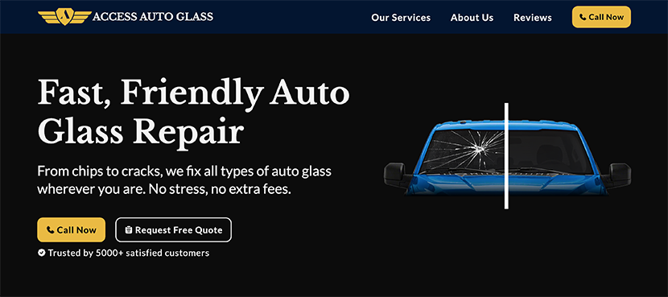

# Access Auto Glass Website

This repository contains the source code for the official **Access Auto Glass** website.  
The site was built to help customers in Los Angeles County quickly find auto glass services, request quotes, and contact the business directly.

## Live Website

[https://accessautoglass.com](https://accessautoglass.com)

## Preview



---

## Technologies Used

- **Frontend**

  - HTML5
  - CSS3 (with responsive design)
  - Vanilla JavaScript
  - Google Tag Manager (event tracking)
  - CookieYes (cookie consent banner)

- **Hosting & Infrastructure**

  - AWS CloudFront (CDN + HTTPS)
  - Cloudflare (domain management)
  - Static file hosting (via AWS S3 / CloudFront)

- **Other**
  - GitHub for version control
  - SEO meta tags and sitemap for indexing

---

## Project Structure

```

├── assets/          # Images, icons, logos
├── js/              # JavaScript files
├── styles.css       # Main stylesheet
├── index.html       # Homepage
├── privacy-policy.html
└── README.md

```

---

## Running Locally

1. **Clone the repo:**

   ```bash
   git clone https://github.com/joebernal/Access-Auto-Glass-Website.git
   ```

2. Navigate into the project folder:

   ```bash
   cd Access-Auto-Glass-Website
   ```

3. Open `index.html` in your browser.

---

## Features

- Mobile-friendly responsive design
- Call-to-action buttons for **“Call Now”** and **“Request Free Quote”**
- Customer review section from Google Maps
- Privacy Policy page
- Integrated Google Tag Manager for tracking events (form submissions, scrolls, downloads)
- Cookie consent banner for compliance

---

## Future Improvements

- Expand service pages (e.g., Windshield Replacement, Chip Repair, Insurance Claims)
- FAQ section to improve SEO
- Showcase more Google Reviews
